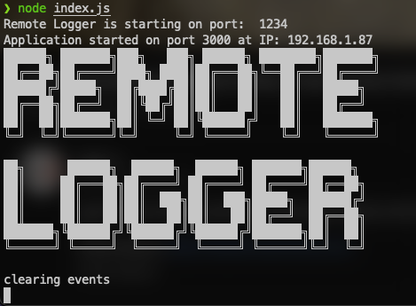
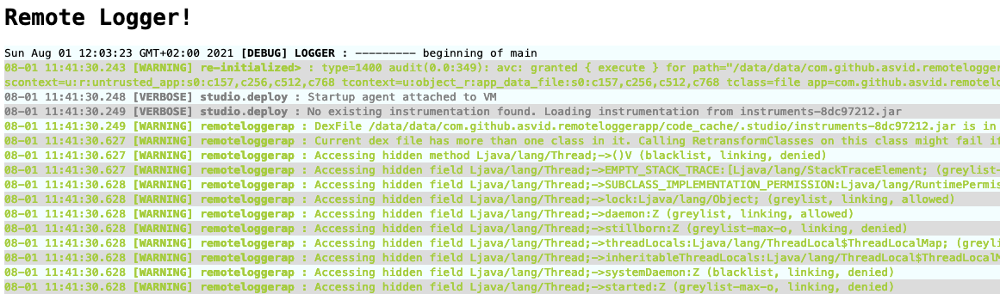

# RemoteLogger [](https://jitpack.io/#asvid/RemoteLogger)

Little tool that allows Android apps to send Logcat logs via websocket to server hosted on a developer machine - useful when the app has to be in release mode without developer options turned on (real live case...)

> This is work in progress.
> I probably butchered ExpressJS and Kotlin Coroutines here, but well, it works :)

## How to run
This is very specific use-case dev tool, it's not mentioned to be user friendly.

### Run server first
Go to `server` directory and run `npm install` to get all dependencies.
Then run `node index.js`. If you want to run at specific port, then use `WS_PORT=1111 node index.js`.
Server will open the browser with logs page, but it won't refresh automatically, you have to do it manually.



### Android
Add Jitpack to your repositories in root `build.gradle` or `settings.gradle`:
```groovy
allprojects {
    repositories {
        ...
        maven { url 'https://jitpack.io' }
    }
}
```
And library dependency in project:
```groovy
	dependencies {
	        implementation 'com.github.asvid:RemoteLogger:0.2.0'
	}
```

In Android app, init the library in the Application class `onCreate()` method, like this:
```kotlin
RemoteLogger().initialize(
    Config(
        "192.168.1.87", // your server IP, will be displayed in CMD after server is started
        1234, // optional port
        applicationContext.packageName // package name, required for proper LogCat filtering
    )
)
```

After `initialize()` is called, websocket tries to connect to server so it has to be started first.
After it connects it sends all the logs that were already gathered by LogCat, so nothing is lost.
Each application restart clears the logs.



When app crashes the exception is also logged remotely, and then app exits with code `1`.

You can still see the logs in Android Studio Logcat, the hijacking is transparent :)
